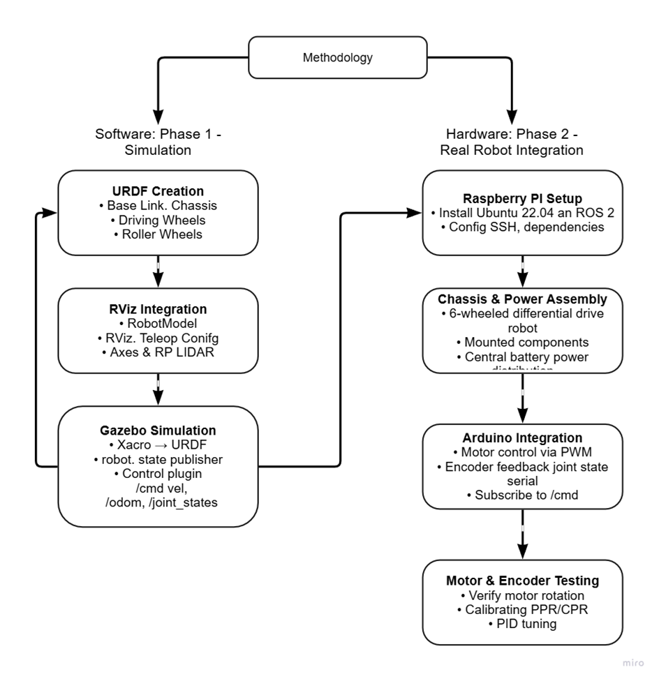

# Rosbot

## Overview

This repository provides a comprehensive template for quickly setting up a autonomous differential drive robot using ROS2. It includes the necessary configurations, files, and instructions to launch robot simulations, visualize robot states, and integrate control interfaces seamlessly.
This was the part of our Academic Project for the Course Robotics Operating System(ROS) 

## Features

* **Simulation:** Ready-to-use Gazebo simulation launch files.
* **Robot State Publisher:** Configuration and launch files for broadcasting robot states.
* **RViz Visualization:** Pre-configured RViz settings for robot model visualization.
* **Modular Structure:** Clearly organized directories for configurations, launch files, and robot descriptions.
* **ROS2 Control Integration:** Full support for ROS2 control interfaces.
                                For ROS2 Foxy- Use Main Branch
                                For ROS2 Humble- Use Humble Branch


## Getting Started

### Installation

1. Clone the repository:

```bash
git clone https://github.com/VaradHere/rosbot.git
cd rosbot
```

2. Install Dependencies:

Make sure your ROS2 environment is properly set up. Install any required dependencies (e.g., Gazebo, ROS2 Control) if not already installed.

```bash
sudo apt install ros-<ros2-distro>-gazebo-ros-pkgs ros-<ros2-distro>-ros2-control ros-<ros2-distro>-ros2-controllers
```

Replace `<ros2-distro>` with your installed ROS2 distribution (e.g., `humble`, `iron`).

### Running the Simulation

**Launch Gazebo Simulation:**

```bash
ros2 launch rosbot gazebo_sim.launch.py
```

**Visualize Robot in RViz:**

```bash
ros2 launch rosbot rsp.launch.py
```

## Directory Structure

```
rosbot/
├── config/                             # Configuration files for RViz and controllers
├── description/                        # URDF and Xacro files defining the robot model
├── images/                             # Images used in documentation
│ └── methodology/                      # Methodology diagram (ROS2 workflow)
│ └── output                            # Progress and Results 
├── launch/                             # Launch files for simulation and robot state publisher                           
├── worlds/                             # Gazebo world files
├── CMakeLists.txt                      # CMake build configuration
├── LICENSE.md                          # License information
├── package.xml                         # ROS 2 package manifest
└── README.md                           # Project documentation


```
## Hardware Stack
**Components Lists**

Raspberry Pi 4
Serves as the main onboard computer running ROS2 nodes and handling overall robot control and communication.

A1M8 360° LiDAR
Provides 360-degree environment scanning for mapping, obstacle detection, and navigation.

Arduino Uno
Acts as a microcontroller interface for low-level hardware control like motor commands and sensor inputs.

Planetary Geared DC Motors (x2)
High-torque motors used for driving the robot wheels with better speed and load handling.

L298 Motor Driver
Dual H-bridge motor driver used to control the speed and direction of the DC motors via PWM.

3200mAh 3S LiPo Battery
Powers the entire system, supplying sufficient voltage and current for extended operation time.

## Methodology

The following diagram outlines the software simulation and real hardware integration workflow for the ROS2 robot development:




## Contributing

Contributions are highly encouraged! To contribute:

1. Fork this repository.
2. Create a new feature branch (`git checkout -b feature/YourFeature`).
3. Commit your enhancements (`git commit -m "Add YourFeature"`).
4. Push the branch (`git push origin feature/YourFeature`).
5. Open a Pull Request.

## License

This project is licensed under the **Apache License 2.0**. See the [LICENSE](LICENSE) file for details.

## Acknowledgments

This repository is built upon a robust template designed for rapid ROS2 based Autonomous vehicle development. We extend our sincere thanks to the open-source robotics community and all contributors. We would also like to acknowledge the invaluable support of our faculty mentor and Symbiosis Institute of Technology for providing the platform and equipments that made this project possible.

 
